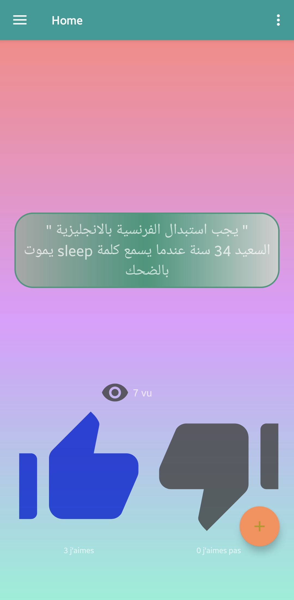
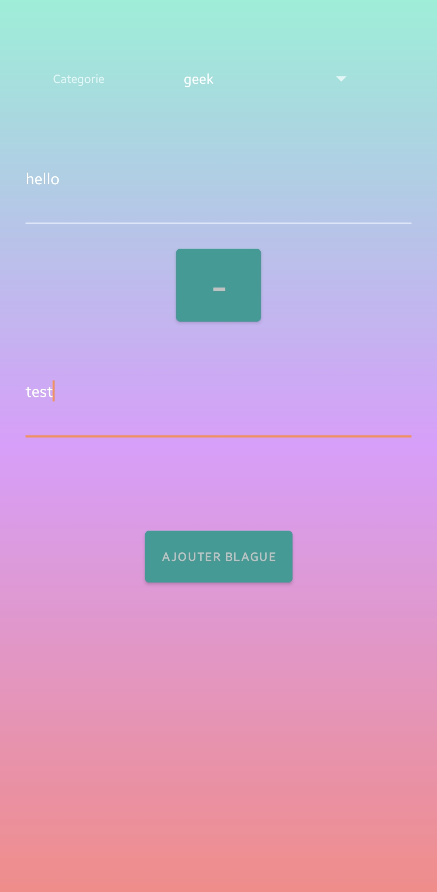
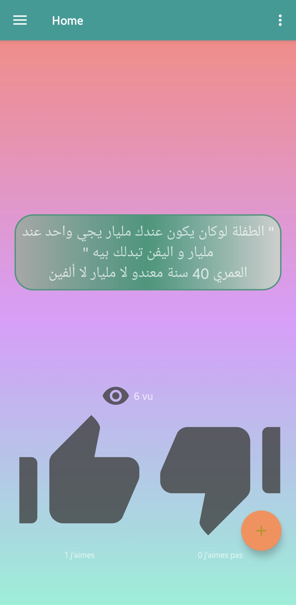
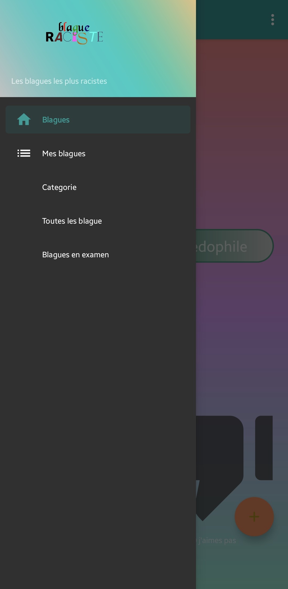

# Blague Raciste (Legacy Project)

**Blague Raciste** is an old personal Java/Android project developed in about two weeks as a fun experiment with Firebase integration.  
It was never intended to be a production-ready application, but it served as a useful playground for testing Android development patterns and cloud backend features.

## 🚀 Features
- Native Android app built with **Java**
- Backend powered by **Firebase**
- Simple UI and lightweight functionality
- Created mainly for experimentation and learning

## 🏗️ Tech Stack
- **Android Studio**
- **Java**
- **Firebase** (Authentication, Database, Storage depending on your implementation)

## 🖼️ Screenshots

  
  
  
  

## ⚠️ Note
This is a **legacy / experimental project** kept for archival and learning purposes.  
The app’s name reflects an inside joke during development, but the project itself does **not** endorse or promote racist content.

## 📦 Status
- Not actively maintained  
- May contain outdated code or dependencies  
- Shared for reference and educational purposes only
